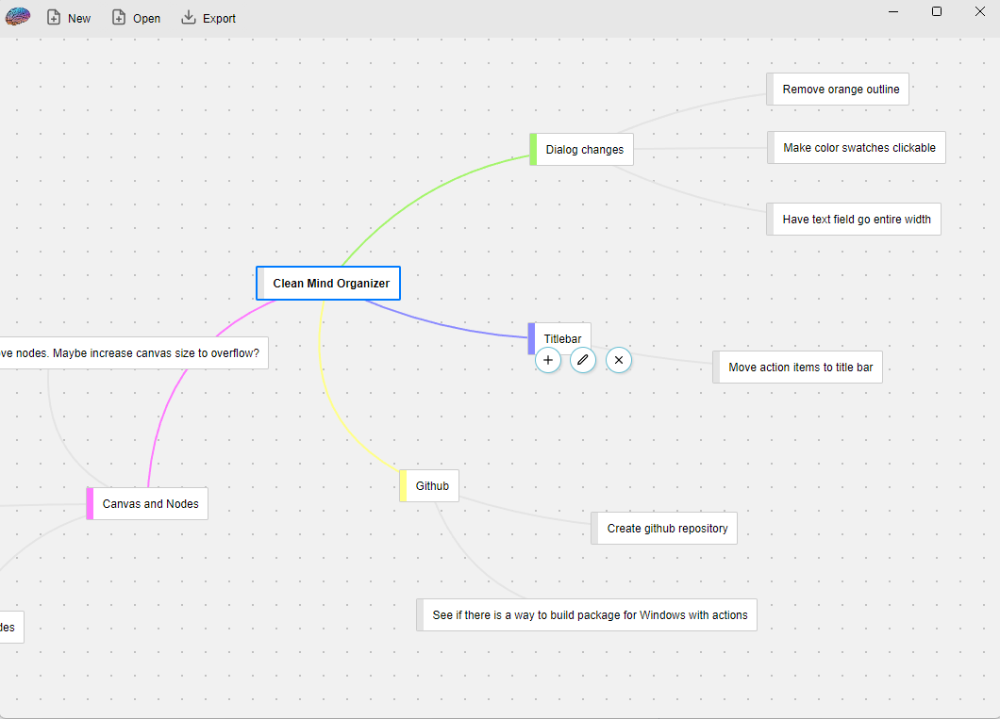

# Simple MindMap
Build a mind map to help organize your ideas or todo items. This was built as an Electron application to learn how it works.

## Feature Set
- Adding nodes, renaming nodes, deleting nodes
- Multiple levels of children
- dragging nodes around for positioning
- Export and Import mind map to JSON format.
- Color labeling

## Building
You need node.js for this. I am on version 18

    npm install
    npm run start

## TODO
When importing JSON file, something isn't being saved/loaded right as dragging starts acting bugged out

## Packaging and Distributing
Electron doesn't come with this ability by default, so the NPM "@electron-forge/cli" 
package is used. All the NPM dependencies that contain "forge" in them are for this purpose.

This packaging is configured through forge.config.js

    npm run make

There will be an "out" folder created which contains the portable executable

